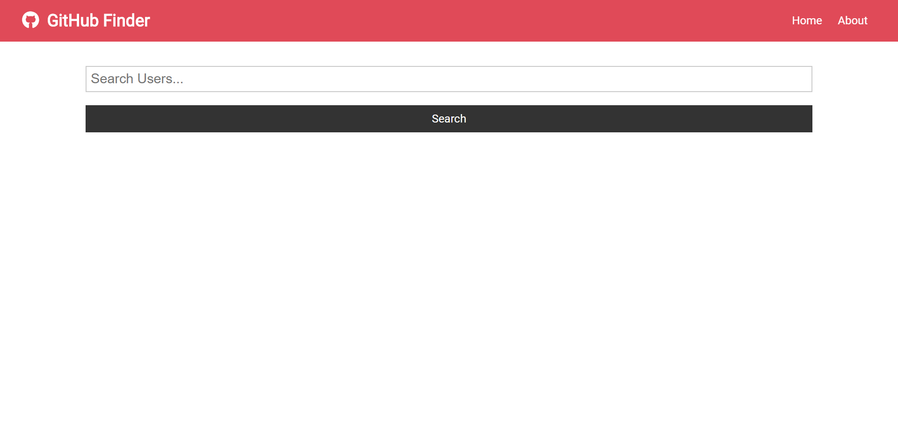
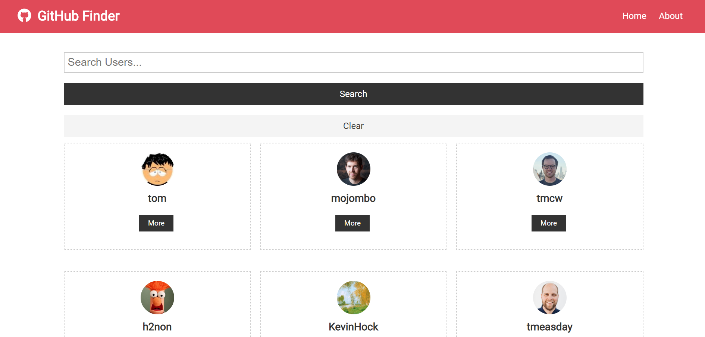
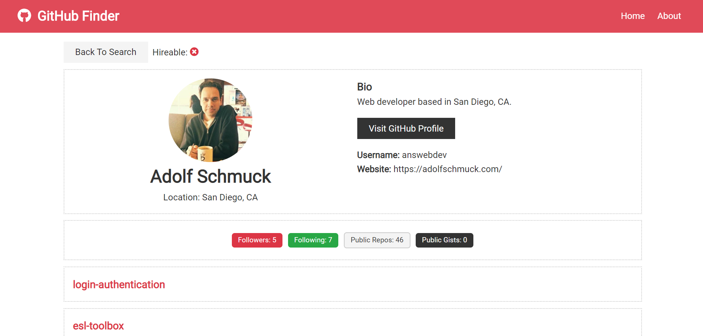

# GitHub Finder

# Project Description

GitHub Finder is a front-end React application that is used to search for GitHub profiles. Requests are made to the GitHub API to fetch and display a user's profile information, latest GitHub repositories, and more. This app uses the Context API, along with the useContext and useReducer hooks for state management, and is part of the "React Front To Back" Udemy course.

A custom CSS file is used, using classes that are similar to Bootstrap. The font used ('Roboto') comes from Google Fonts. Icons used are from Font Awesome. The app is deployed to Netlify.

# Technologies Used

* React
* CSS

# GitHub Finder Live Link

Please check out the live link for GitHub Finder here:

https://githubfinder865987920923.netlify.com/

# Screenshots

